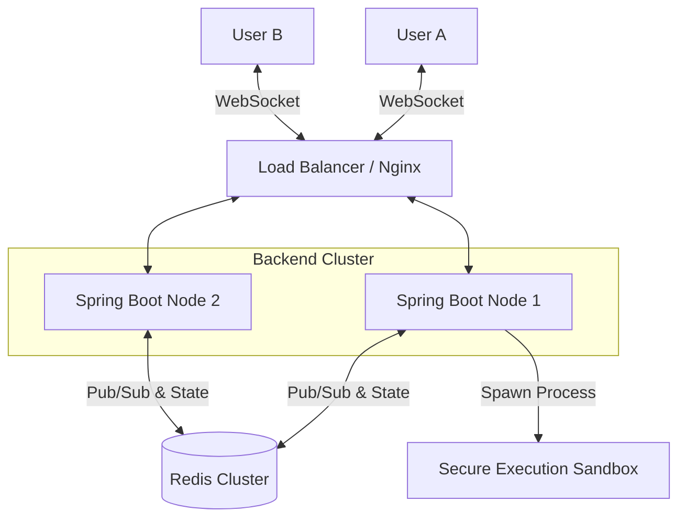

# ⚡ SyncStream

<div align="center">

 


**A High-Performance Real-Time Collaborative Code Editor & Execution Engine.**  
*Built for scale, speed, and seamless synchronization.*

[View Demo](https://github.com/krishnabandewar/SyncStream) · [Report Bug](https://github.com/krishnabandewar/SyncStream/issues) · [Request Feature](https://github.com/krishnabandewar/SyncStream/issues)

</div>

---

## 🚀 Overview

**SyncStream** is a distributed system designed to solve the challenge of **real-time state synchronization** and **remote code execution** at scale. It allows multiple users to join a unique room, write code collaboratively with **sub-50ms latency**, and execute that code in a secure, isolated environment.

This project demonstrates advanced concepts in **Distributed Systems**, **WebSockets**, and **Cloud-Native Architecture**.

## ✨ Key Features

*   **Real-Time Collaboration**: Bi-directional synchronization using **WebSockets (STOMP)** ensures every keystroke is reflected instantly across all connected clients.
*   **Distributed State Management**: Utilizes **Redis** for state persistence and Pub/Sub messaging, decoupling the state from individual application servers.
*   **Remote Code Execution (RCE)**: A robust engine that accepts Java code, compiles it, and executes it in an isolated process, capturing `stdout` and `stderr` streams.
*   **Dynamic Room System**: Users can generate unique session URLs (e.g., `/room/xyz`) to collaborate in private workspaces.
*   **Production-Grade UI**: A sleek, dark-mode interface built with **Next.js**, **Tailwind CSS**, and **Monaco Editor** (the engine behind VS Code).

## 🏗️ System Architecture



## 🛠️ Technology Stack

| Component | Technology | Description |
| :--- | :--- | :--- |
| **Backend** | **Java (Spring Boot)** | Handles WebSockets, REST APIs, and core business logic. |
| **Database** | **Redis** | Used for caching active room state and Pub/Sub messaging. |
| **Frontend** | **Next.js (React)** | Server-side rendered UI with client-side dynamic interactions. |
| **Editor** | **Monaco Editor** | Provides the professional code editing experience (syntax highlighting, etc). |
| **DevOps** | **Docker** | Containerizes the entire stack for consistent deployment. |

## 🏁 Getting Started

### Prerequisites
*   Docker & Docker Compose (Recommended)
*   **OR**: Java JDK 8+, Node.js 18+, Redis Server

### ⚡ Quick Start (Docker)
The easiest way to run the entire stack:

```bash
# 1. Clone the repository
git clone https://github.com/krishnabandewar/SyncStream.git
cd SyncStream

# 2. Start the services
docker-compose up --build
```
Access the application at `http://localhost:3000`.

### 🔧 Manual Setup (Local Dev)

**1. Start Redis**
Ensure a Redis server is running on port `6379`.

**2. Start Backend**
```bash
cd backend-java
mvn spring-boot:run
```

**3. Start Frontend**
```bash
cd frontend
npm install
npm run dev
```

## 🔌 API Endpoints

### REST API
| Method | Endpoint | Description |
| :--- | :--- | :--- |
| `GET` | `/api/room/{roomId}` | Fetches the current code content of a room. |
| `POST` | `/api/execute` | Compiles and runs the provided Java code. |

### WebSocket Events
| Type | Destination | Body |
| :--- | :--- | :--- |
| `SUB` | `/topic/room/{id}` | Listen for code updates from other users. |
| `PUB` | `/app/code/{id}` | Send code changes to the room. |

## 📷 Screenshots

### Landing Page
> A modern, minimal entry point to start a collaboration session.

### Room & Code Execution
> 1. Write Code. 2. Click Run. 3. See output instantly.

---

## 🤝 Contributing

Contributions make the open-source community an amazing place to learn, inspire, and create. Any contributions you make are **greatly appreciated**.

1.  Fork the Project
2.  Create your Feature Branch (`git checkout -b feature/AmazingFeature`)
3.  Commit your Changes (`git commit -m 'Add some AmazingFeature'`)
4.  Push to the Branch (`git push origin feature/AmazingFeature`)
5.  Open a Pull Request

## 📝 License

Distributed under the MIT License. See `LICENSE` for more information.

---

<p align="center">
  Built with ❤️ by Krishna Bandewar
</p>
